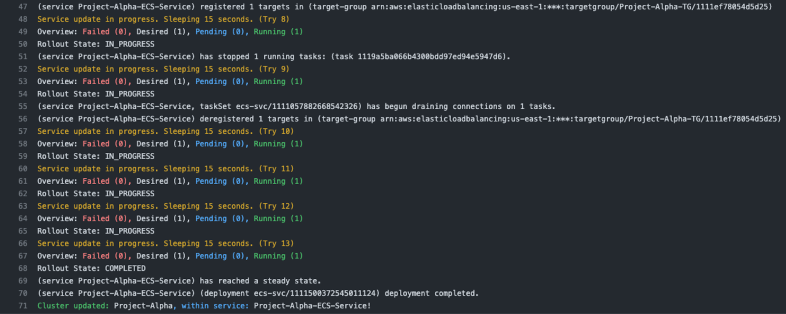
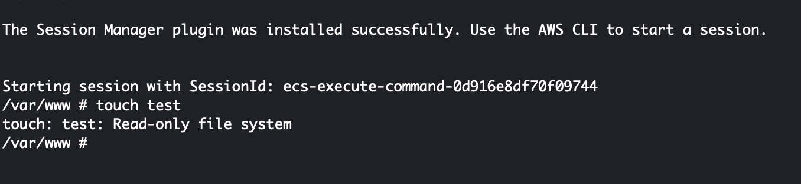
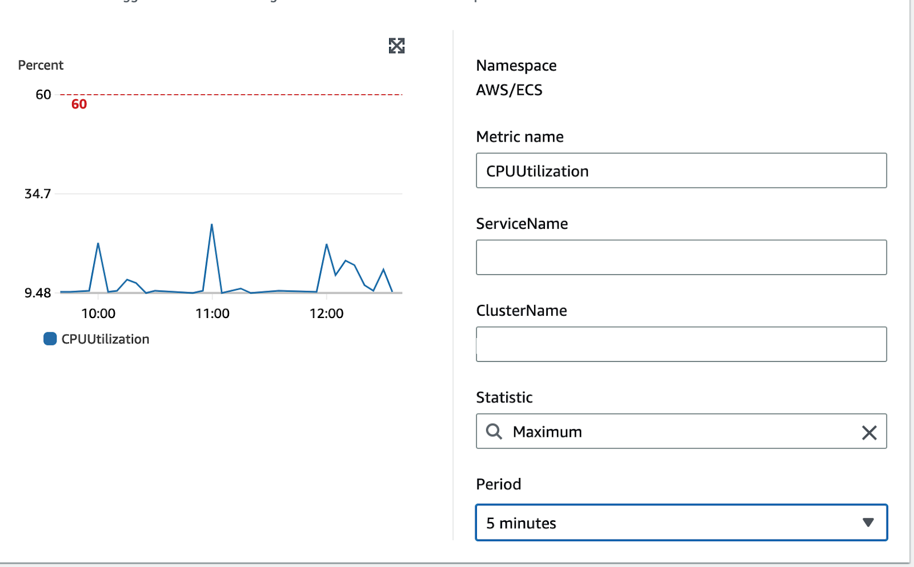

## Introduction

Here at Sourcetoad, we've been working on migrating our PHP framework—mostly Laravel-based projects—to Amazon Web Services' Elastic Container Service (ECS). As we worked through the process, we were surprised at how scattered around the web good information seemed to be. There certainly was no comprehensive guide to run Laravel applications on ECS in what we would consider an enterprise-grade fashion.

Don't get us wrong: many guides exist, but they appeared to be leaving out important information. Some guides had part of the story, and others had the other part. A person needs to already understand AWS best practices to really know what is left out of each one. We thought it would be interesting to share what we have done in a comprehensive guide. This guide is for people who already have a basic understanding of how to run Laravel in Docker and use ECS. It focuses on the hardening and optimizations we have done.

{/* truncate */}

## Migration to Alpine

Our development team has been using Docker locally for quite some time. This allows for super easy project spin up by new team members as well as consistency in environments. Since a few hundred megabytes here or there isn't much of a concern on local environments, we were using the default Debian-based PHP-FPM Docker images.

We knew that we wanted to run Alpine-based images in production. Since these images are significantly smaller, they can be deployed faster both from the CI/CD servers to AWS and from AWS's Elastic Container Registry (ECR) to ECS.

## Multistage Builds

The next step to migrating to a single Dockerfile to be used both locally and on ECS was moving our Dockerfiles to utilize multistage builds. Developers need tools inside their docker container such as xdebug and composer that we don't need inside of the deployment containers. Similarly, deployment containers need to copy instead of volume mount, use separate writable volumes for read-only file systems (we will get to that below), and other things.

Multistage builds allow us to easily build common parts of the container then make a separate build stage for development images. We start with the common items shared between both deploy and local development as so:

```dockerfile
FROM php:8.1-fpm-alpine AS base

RUN apk -U add --no-cache \
	bash zip unzip gzip wget libzip libgomp libzip-dev libpng libpng-dev freetype-dev icu icu-dev libjpeg \
	libjpeg-turbo-dev libpq perl shadow libpq-dev imagemagick imagemagick-dev linux-headers util-linux && \
	apk add --no-cache --virtual .phpize-deps $PHPIZE_DEPS && \
	pecl install imagick redis && \
	docker-php-ext-configure gd --with-jpeg --with-freetype && \
	docker-php-ext-enable imagick redis && \
	docker-php-ext-install gd calendar zip bz2 intl bcmath opcache pdo pdo_mysql && \
	apk del .phpize-deps
```

Next we will add the local items as a section from base:

```docker
# Local (Developer)
FROM base AS local

RUN apk -U add --no-cache mariadb-client && \
	apk add --no-cache --virtual .phpize-deps $PHPIZE_DEPS && \
	pecl install xdebug && \
	docker-php-ext-enable xdebug && \
	apk del .phpize-deps

WORKDIR /code
```

Finally, we will add the deployment items as a section from the base:

```docker
FROM base AS deploy

RUN apk -U upgrade && apk add --no-cache supervisor aws-cli

RUN cp /usr/local/etc/php/php.ini-production /usr/local/etc/php/php.ini && \
	rm /usr/local/etc/php-fpm.d/docker.conf && \
	sed -i -e "s/;date.timezone\s*=.*/date.timezone = 'UTC'/" /usr/local/etc/php/php.ini && \
	sed -i -e "s/.*expose_php\s*=.*/expose_php = Off/" /usr/local/etc/php/php.ini
	### Add further customizations to php.ini, www.conf, etc here

COPY ./docker/code/config/deploy/supervisor.conf /etc/supervisord.conf
COPY ./docker/code/config/deploy/entrypoint.sh /usr/bin/entrypoint.sh
COPY ./docker/code/config/deploy/crontab /etc/crontabs/www-data
COPY ./ /var/www/html

RUN chmod 755 /usr/bin/entrypoint.sh && \
	chmod 777 /tmp && \
	chown -R www-data.www-data /var/www && \
	rm -rf /var/www/html/docker

VOLUME /var/lib/amazon
VOLUME /var/log/amazon
VOLUME /var/www/html/bootstrap/cache
VOLUME /var/www/html/storage
VOLUME /opt/php
VOLUME /tmp

WORKDIR /var/www

CMD ["/usr/bin/entrypoint.sh"]
```

Let's look at some of the more interesting items in this section:

```docker
RUN apk -U upgrade && apk add --no-cache supervisor aws-cli
```

A lot of debate exists about if you should run apk upgrade prior to deployment. At huge organizations with legions of dedicated devops people to recreate releases for every security update, it makes sense that you would want completely reproducible builds.

However, like some other Linux distributions, Alpine makes a concerted effort to ensure API/ABI compatibility of package updates for security. We feel, for all but the largest enterprises, it makes sense that the deployment package to get the latest security updates. That way, if a vulnerability comes out in a specific version of Alpine, the container can be rebuilt and deployed even if the php-fpm maintainers haven't updated their base version yet.

We are also installing supervisor and the aws-cli. The aws-cli is used to allow Amazon's ECS exec to work in the container for debugging purposes.

:::info
`screen` is also needed for this to work, but that is included in util-linux package in the base stage.
:::

Supervisor is being used so that the container can run laravel queues and crons, as well as php-fpm. Ideally, large projects would have completely separate tasks that just run queues and crons. However, as the vast majority of our projects have extremely lightweight queue and cron tasks, it didn't make sense to have even a couple of 1/4 size Fargate CPU tasks dedicated to them.

```docker
COPY ./docker/code/config/deploy/supervisor.conf /etc/supervisord.conf
```

This is our supervisor entry that runs the following tasks: crond, the queue workers and php-fpm.

Best practice in Docker is to log the error and other log-type events to the stdout and stderr. Supervisor has built in log rotation. That needs to be disabled by setting the maxbytes to 0 for all the log file definitions. That can be seen here.

```ini
[supervisord]
nodaemon=true
user=root
logfile=/dev/stdout
logfile_maxbytes=0
pidfile=/opt/php/supervisord.pid

[unix_http_server]
file=/opt/php/supervisord.sock

[supervisorctl]
serverurl=unix:///opt/php/supervisord.sock

[rpcinterface:supervisor]
supervisor.rpcinterface_factory = supervisor.rpcinterface:make_main_rpcinterface

[program:php]
command=php-fpm
autostart=true
autorestart=true
user=root
startretries=100
numprocs=1
stdout_logfile=/dev/stdout
stdout_logfile_maxbytes=0
stderr_logfile=/dev/stderr
stderr_logfile_maxbytes=0

[program:crond]
command=crond -f
autostart=true
autorestart=true
user=root
startretries=100
numprocs=1
stdout_logfile=/dev/stdout
stdout_logfile_maxbytes=0
stderr_logfile=/dev/stderr
stderr_logfile_maxbytes=0

[program:laravel-queue-worker]
command=/usr/local/bin/php /var/www/html/artisan queue:work --timeout=0 --tries=3
autostart=true
autorestart=true
user=www-data
startretries=50
numprocs=1
stdout_logfile=/dev/stdout
stdout_logfile_maxbytes=0
stderr_logfile=/dev/stderr
stderr_logfile_maxbytes=0
```

```docker
COPY ./docker/code/config/deploy/entrypoint.sh /usr/bin/entrypoint.sh
```

This entrypoint pulls in a few things, such as the .env file to a writable location on the filesystem. However, the most interesting thing at it are the end lines:

```bash
cd /var/www/html || exit 1

su -s /bin/sh www-data -c "php artisan optimize"

if [ -n "$RUN_MIGRATIONS" ]; then
  su -s /bin/sh www-data -c "php artisan migrate --no-interaction --force --isolated"
else
  /usr/bin/supervisord -c /etc/supervisord.conf
fi
```

This is pretty cool. It allows us to use the same docker container to do both migrations and run the application. We just create another task definition with the RUN_MIGRATIONS variable defined. We have our CI/CD run this task first, before updating the service with the new containers during a release.

```docker
VOLUME /var/lib/amazon
VOLUME /var/log/amazon
VOLUME /var/www/html/bootstrap/cache
VOLUME /var/www/html/storage
VOLUME /opt/php
VOLUME /tmp
```

We are going to discuss the advantages of the read-only root file system in the security section. When this is set, all files inside the root file system are read-only. This means any locations that need to accept data writes need to be either defined as separate volumes in the docker file, bind mounts in the ECS task definition, or EFS mounts.

Bind mounts are used inside the ECS task definition when ephemeral data needs to be shared between multiple tasks. We utilize this in some older Yii2 projects where the asset cache is built at runtime and needs to be shared between the nginx and php-fpm containers. Laravel prebuilds these assets, and the public directory just needs to be copied into the nginx container.

EFS mounts are used when data is not ephemeral and needs to survive service/container destruction. Ideally, a system stores this type of data on something like S3, but doing so is not always practical.

Finally, the volumes defined in the docker file are used for ephemeral storage that exists only within the one container for its lifespan.

* The first two are used by Amazon for ECS Exec.
* The next two are the standard places Laravel needs to write data.
* `/opt/php` will be used for placing the .env file, other supervisor pid files, etc
* `/tmp` is the default temp location on linux

Since we the base app path isn't writable and be used for the .env file, we had to make a slight modification to the Laravel bootstrap app.php:

```php
<?php

/*
|--------------------------------------------------------------------------
| Create The Application
|--------------------------------------------------------------------------
|
| The first thing we will do is create a new Laravel application instance
| which serves as the "glue" for all the components of Laravel, and is
| the IoC container for the system binding all of the various parts.
|
*/

$app = new Illuminate\Foundation\Application(
    $_ENV['APP_BASE_PATH'] ?? dirname(__DIR__)
);


// Ensure in ECS we override location where .env is at, fallback if not set.
// This is prior to dotenv being invoked - so check getenv() directly.
$envLocation = getenv('APP_ENV_PATH') ?: '';
$app->useEnvironmentPath($envLocation);
```

When we define `APP_ENV_PATH` in our task definition to something like `/opt/php/`, Laravel will then use that path to look for the env file.

The nginx Dockerfile is quite a bit simpler, as the only customizations we use are for deployment.

```docker
FROM nginx:stable-alpine as base
FROM base as deploy

RUN apk -U upgrade && apk add --no-cache util-linux

COPY ./docker/nginx/config/deploy/nginx.conf /etc/nginx/nginx.conf
COPY ./docker/nginx/config/deploy/self-signed.com.* /etc/nginx/

RUN mkdir -p /var/www/html/public
COPY ./public /var/www/html/public

VOLUME /var/lib/amazon
VOLUME /var/log/amazon
VOLUME /run
VOLUME /var/cache/nginx

WORKDIR /var/www/html

EXPOSE 80 443
```

The most interesting line in the nginx Dockerfile is below:
```docker
COPY ./docker/nginx/config/deploy/self-signed.com.* /etc/nginx
```

For our SOC2 compliance, we use encryption in transit everywhere, even within the private VPCs of AWS. As per the AWS documentation, the ALB does not verify SSL certificates, it ensures the traffic is going to the correct location through other methods. For the ALB to Target Group Member traffic, they recommend using self-signed certificates.

During our CI/CD process, we generate a self-signed certificate. This is placed into the container and then used by nginx. The nginx is configured to only listen on 443 and the only inbound traffic allowed on the security group for the task is from the ALB on port 443.

That brings us nicely to the process we use to deploy this system with GitHub Actions.

## Deployment with GitHub Actions

GitHub Actions is quickly growing with an abundance of actions capable of fully deploying most types of Amazon products. Amazon has launched a few official actions in their [GitHub](https://github.com/aws-actions) to aid with deployment to ECS. After examining these it seemed like we might need many different actions in order to:

* login to ECR
* configure OIDC AWS credentials
* deploy a ECS task definition
* edit/render a ECS task definition

This quickly became another possibility for us to create another open source GitHub Action to unify these actions into a smaller set. We have experience maintaining an open source action for deploying via [CodeDeploy](https://github.com/sourcetoad/aws-codedeploy-action), so we set out to build another action for deployment via [ECS](https://github.com/sourcetoad/aws-ecs-deploy-action).

Our goal with our design was to unify the effort between the task definition and deployment. For most common situations the only change during a deployment is swapping out the image property so your established task definition just deploys a different container than last time.



Our designed action excelled at this by automating the process of obtaining the latest task definition, swapping in the recently built container and updating the service with that updated task definition while monitoring the release.

## Security

As we migrated to the running laravel on ECS, we made quite a few security enhancements. Some of these are possible to implement in legacy systems, some required moving to this type of setup.

### Read Only Root Filesystem



We spoke above about the Read Only Root Filesystem option we are utilizing on our containers running in ECS. This is a setting inside the task definition called "readonlyRootFilesystem." When it is enabled, the root file system of the container operates in read only mode. Nothing can alter the files on that file system. It is immutable. Any volatile files must be specifically mounted in as described above with the various mount options.

This one simple setting bestows two major benefits.

The first benefit is that it really forces an entire organization from devops to developers to embrace cloud-first architecture. Containers are ephemeral, and we really need to know every possible location inside of the application that data might be written. This forces everyone to understand and have a strategy for any file system writing that the application performs. If someone accidentally forgets to take care when performing file system writes, they will immediately fail. This is many times better than hiding on a server only to cause issues in the future.

The second is related to compliance and malicious code. Compliance items such as File Integrity Monitoring or server-side Antivirus Scanning all are attempting to solve the problem of malicious users or software modifying code to perform malicious tasks. File Integrity Monitoring also might be used to prevent cowboy coding changes to software by developers or devops personnel with little-to-no oversight.

Having a Read Only Root Filesystem renders both of these issues moot. File Integrity Monitoring is not needed, the files can't be changed, it's not possible. The system is doing one better than alerting about changed files after the fact, the files are immutable by design. Server-side Antivirus Scanning isn't needed either. A virus can't get onto a file system that is immutable

:::info
Antivirus Scanning that runs on the server monitoring user uploads or email for viruses obviously is still needed.
:::

Many PHP vulnerabilities revolve around a bad actor getting his or her files onto the file system through some security flaw. This simply is not possible if the file system is read only.

### Vulnerability Scanning

When a file system is immutable, that doesn't mean it can't have security vulnerabilities in the software that it is running. CVEs are released all the time for software that we want and intend to have on our file system.

Amazon Elastic Container Registry and ECS work hand-in-hand. While containers referenced in task definitions don't have to be on ECR, CI/CD workflows are so much cleaner when ECR is used. ECR has Enhanced Image scanning. This scanning looks not only at the applications installed in the container, but also at the package dependencies at the application level. This package scanning provides a nice second check beyond the Github Dependabot scanning we already use.

Enhanced Image scanning can run both on push of new containers and continuously. The continuous option means that any future CVEs that are found in your container as time goes by will be found by the scanning. An image that had no vulnerabilities on push will be monitored going forward to make sure no new vulnerabilities come out that affect it.

### NAT Gateway

Using a private subnet with a NAT gateway isn't something specific to ECS. It's just good practice in general.

In our VPCs we always create at least two subnets. The first is public. That one will contain the items that need publicly facing IPs. This mostly consists of the Application Load Balancer and NAT gateway(s). It has a path to the internet through an Internet Gateway.

The second is private. That will contain everything else. It has a path to the internet through a NAT gateway or gateways. NAT gateways exist in a single availability zone, so for highest availability, we would need a NAT gateway for each individual AZ for each subnet. Usually, outbound internet connectivity is not absolutely critical for all app functionality, so we don't need to make that many NAT gateways (as each one has a cost).

NAT gateways have quite a few security advantages. When Fargate tasks only have Private IPs, they can only reach out to the Internet. Actors on the Internet have no ability to reach back to them. This prevents accidental ingress due to misconfigured security groups. It also helps with compliance because system controls (a system preventing someone from doing something) are always better than manual or policy based controls whereby a person has to remember not to do something.

## Monitoring
After moving to ECS, we needed to figure out how to monitor the environment. We had some key events that could happen within ECS that we wanted to monitor.

### CPU Usage

We wanted to create alarms on CPU usage for each of our ECS services. These are relatively straightforward with Cloudwatch, as its simply an Alarm on Service in the Cluster:



Of note is we select the Maximum CPU usage. We aren't interested in the average in terms of telling if a system is overloaded.

### Image Scan Alarm

We have to use EventBridge for all the rest of the alarms. It took some trial and error to get these patterns the way we wanted.

The first alarm we want is to know if our Enhanced Scanning is picking up any findings.

Here is the rule we use:

```json
{
  "source": ["aws.inspector2"],
  "detail-type": ["Inspector2 Finding"],
  "detail": {
	"severity": ["CRITICAL"],
	"status": ["ACTIVE"]
  }
}
```

We do audits on a regular basis looking at Amazon Inspector for findings. We get a lot of noise if we alert on severities other than critical. If we wanted to alert on HIGH as well, we would create an array such as:

```
"severity": ["HIGH","CRITICAL"],

```

### Deployment Alarms
The devops team likes to know when deployments occur on production environments.

Here is the rule we use:

```json
{
  "source": ["aws.ecs"],
  "detail-type": ["ECS Deployment State Change"],
  "resources": ["ARN_OF_PROD_ECS_SERVICE"]
}
```

We replace the ARN_OF_PROD_ECS_SERVICE with the actual arn. If we wanted to alert on deployments of more services, we could add them to the array. We could remove the resources entirely if we wanted alerts on all deployments.

### Service Alarms
We want to know when the state of the ECS service changes in any way that isn't just informational. Events such as failed deployments will fall into this category.

Here is the rule we use:

```json
{
  "source": ["aws.ecs"],
  "detail-type": ["ECS Service Action"],
  "detail.eventType": [{
	"anything-but": "INFO"
  }]
}
```

### Task Alarms
We want to know if the individual tasks inside services or separately (in the case of migration tasks) exit with a non-success exit code.

Here is the rule we use:

```json
{
  "source": ["aws.ecs"],
  "detail-type": ["ECS Task State Change"],
  "detail": {
	"stopCode": [{
  		"anything-but": "ServiceSchedulerInitiated"
	}],
	"lastStatus": ["STOPPED"],
	"containers": {
  		"exitCode": [{
    			"anything-but": 0
  		}]
	}
  }
}
```

Notice how we exclude ServiceSchedulerInitiated events. These events are when ECS is making changes that we requested such as deployments.

In conclusion, Sourcetoad’s journey to migrate our Laravel-based projects to AWS ECS has been a testament to both the challenges and triumphs of adapting to cutting-edge cloud services. Through sharing our experience, we aim to illuminate the path for others and highlight that, while the transition to ECS may be demanding, the scalability, security, and performance gains are well worth the effort. We encourage teams to embrace the meticulous planning and execution that such a move entails and hope our insights contribute to smoother migrations for many more Laravel applications into the ECS ecosystem.
