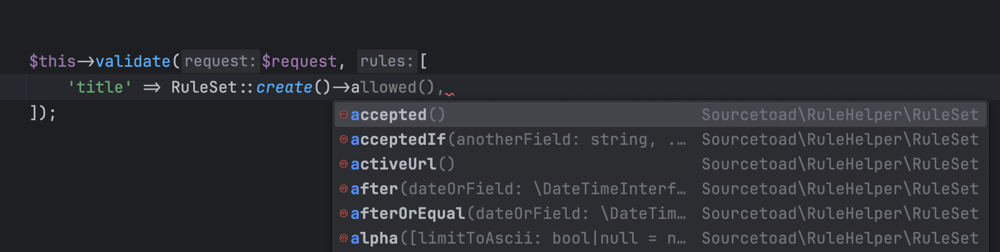

As our applications moved from Laravel 4 into the future versions we noticed an issue that occasionally came up. Laravel validation rules in the early days of Laravel were primarily leveraged using string concatenation with pipe (`|`) characters.

```php
$this->validate($request, [
  'title' => 'required|unique:posts|max:255',
  'body' => 'required',
]);
```

This added a bit of a mental overhead to know all the variations these rules offered and would require a fair amount of trips to the documentation to remember all the possible validation options. Additionally, if you made a typo on some of the rule names Laravel would just silently skip that rule during validation. If you didn't have great test coverage it was pretty easy to make a mistake with this style of validation writing.

We were in search of a more fluent approach to validation rules and as the release of Laravel 8 arrived we decided to create a package to solve our issue.

{/* truncate */}

We knew that validation re-use and IDE support was key so we set off to reproduce the above example in the most fluent way possible.

```php
$this->validate($request, [
  'title' => RuleSet::create()
      ->required()
      ->unique('posts')
      ->max(255),
  'body' => RuleSet::create()
      ->required(),
]);
```

With the fluent class based structure our tooling could enumerate all possibilities enhancing the developer experience and reducing mistakes.

<div class="text--center">
  
</div>

As Laravel 9 and 10 arrived we saw the introduction of more and more fluent validation rules added. This meant it was increasingly possible to write validation rules without any magic strings, but Laravel itself was not 100% covered with fluent rules.

So our package continued to be updated for each major Laravel version (or even minor when a validation rule was changed).

This package is an instant addition on any new project we do to elevate the developer experience and reduce potential for errors.

* [GitHub Repo](https://github.com/sourcetoad/rule-helper-for-laravel)
