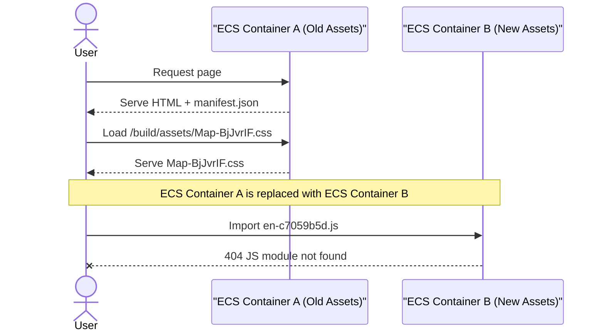
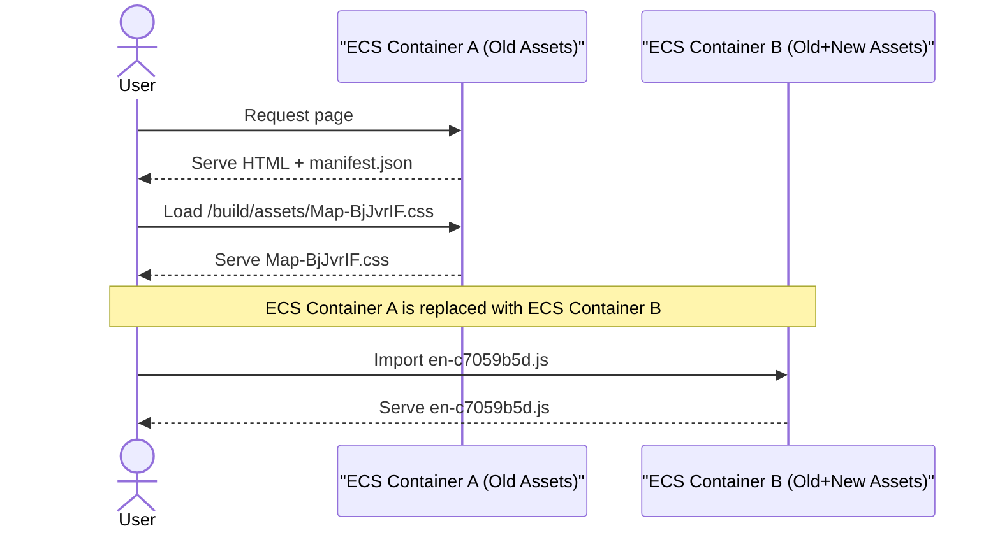

As Laravel said goodbye to Laravel Mix and embraced Vite we saw some new exception in our logs as we completed the migration.

```text
Unable to preload CSS for /build/assets/Map-BjJvrIF-.css
Failed to fetch dynamically imported module build/assets/en-c7059b5d.js
```

We went on a journey to fix this issue and this blog is our findings.

{/* truncate */}

If we roll the clock back to the era of [Laravel Mix](https://github.com/laravel-mix/laravel-mix) we'd encounter a wrapper around the ever powerful Webpack. The way this was configured by default in Laravel was to produce one large minified and transpiled blob of Javascript compatible for all web browsers. This file was named `app.js` in most instances and was served for your end users. This made your Mix manifest file — which was responsible for cache busting relatively — easy with only 1 or 2 entries in an unconfigured setup.

```json
{
    "/js/app.js": "/js/app.js?id=xxx",
    "/css/app.css": "/css/app.css?id=xxx"
}
```

In some cases these Javascript files were rather large hitting sizes over multiple megabytes. This meant any changes to business code required a re-download of a large file. Webpack offered solutions like code splitting which could do library extraction pretty well to separate files, but was rather complex to code splitting based on business logic itself.

For example in Laravel Mix you might do something like this to cut a large file into smaller ones based on vendor dependencies.

```js
mix.extract(['vue', 'lodash-es'], 'vendor~utils-1.js');
mix.extract(['jquery', 'axios'], 'vendor~utils-2.js');
mix.extract();

// `vendor~utils-1.js` will contain Vue and Lodash
// `vendor~utils-2.js` will contain jQuery and Axios
// `vendor.js` will contain all other used libraries from node_modules
```

When Vite was announced as the new default in Laravel and removed that entire motto for a more component based file compilation we were excited to try it out. It was such a different experience with our comparable manifest file (`manifest.json`) showing a much larger configuration file.

```json
{
 "resources/scripts/main.ts": {
    "file": "assets/main-nSaA45LJ.js",
    "name": "main",
    "src": "resources/scripts/main.ts",
    "isEntry": true,
    "dynamicImports": [
      "resources/scripts/common/pages/NotFoundErrorPage.vue",
      "resources/scripts/staff/StaffRoot.vue",
      "resources/scripts/staff/pages/Main.vue",
      "resources/scripts/languages/en.ts"
    ],
    "css": [
      "assets/main-CV0pQy29.css"
    ],
    "integrity": "sha384-agKkQJXZ2DqIYbgTHPHXUPkL2/sSLAf07oX9noZbygK0tzhcMcJlpv7nMNh9OvA7"
  },
  "resources/scripts/staff/StaffRoot.vue": {
    "file": "assets/StaffRoot-BZxauUaN.js",
    "name": "StaffRoot",
    "src": "resources/scripts/staff/StaffRoot.vue",
    "isDynamicEntry": true,
    "imports": [
      "resources/scripts/main.ts",
      "_UserNavigation-fnHU-q3n.js",
      "_SolidButton-Cw9HGNbF.js",
      "_BaseButton.vue_vue_type_script_setup_true_lang-14UuVZfO.js"
    ],
    "integrity": "sha384-F0jLZcGQexy29HmQkzuz3g/dvj/gqXq7HGnUX0KcvxMsTdwsGw78EOV0aUTrOQfq"
  }
}
```

This is an extremely shortened version of the manifest file, but we can tell what is happening here. Each component has a list of imports it may leverage - so Vite can optionally preload those as well as plenty of information to help securely load files and identify all the dependencies a component may have. As you navigate the website you are lazily loading the components you need and not the entire application. This is a great experience for the end user as they are only downloading what they need when they need it.

Unfortunately for us our Sentry logging captured an immediate spike of errors during testing of errors like:

```text
Unable to preload CSS for /build/assets/Map-BjJvrIF-.css
Failed to fetch dynamically imported module build/assets/en-c7059b5d.js
```

As we dug into this it started making sense. We deploy ECS containers with all the prebuilt assets inside - so during a software deployment all the assets from the previous deployment are gone. So someone navigating our website during a deployment or just a stale tab may experience this issue.



As the graph above shows - a user might be trying to load an asset from the newly deployed container that does not exist as it only existed on the previous container! This creates an ugly issue and was not something we experienced with Laravel Mix, because we only had 1 massive file downloaded. Naturally an end user got the entire frontend downloaded on initial load on our older solution.

This is a common problem known as "version skew" and has a few different methods to fix:

1. `lazyWithRetry` - A method to trigger a full page refresh if a component is not found. The natural refreshed page would grab the latest `manifest.json` and thus latest assets and work.
2. Leveraging Vite chunking as [recommended via Vite](https://router.vuejs.org/guide/advanced/lazy-loading.html#With-Vite) to keep all "chunks" from a page together.
3. Replicate the [Skew Protection](https://vercel.com/blog/version-skew-protection) that Vercel offers for Node based solutions.

We thought about these options and felt it was best to design our own based on our interpretation of how "skew protection" works on Vercel. We didn't want to change our codebase nor manage custom chunking rules so we felt it was best to roll our own solution.

We knew that during a deployment we lost track of our previous deployment assets, so we had an idea. Why not just deploy the old assets from the last deployment alongside the new one? The assets were hashed in a way that represented the contents so we did not foresee any issue.

First, we needed the old assets in an easier way - since extracting assets from an ECR image in AWS was not an elegant option. We tweaked our GitHub Action workflow to upload these assets for safe keeping in S3.

```yaml
- name: Upload Assets to S3
  shell: bash
  working-directory: public/build
  run: aws s3 sync . s3://$BUCKET/public-assets/$ENV_CODE
  env:
    BUCKET: ${{ inputs.aws_bucket }}
  ENV_CODE: ${{ inputs.env_code }}
```

So now each deployment we collected all our frontend assets in a common directory. After that we made a change so that a build could download the older assets in order to pipe them into the newly build image.

```yaml
- name: Downloads S3 to /public/build
  shell: bash
  working-directory: public/build
  run: aws s3 sync s3://$BUCKET/public-assets/$ENV_CODE .
  env:
    BUCKET: ${{ inputs.aws_bucket }}
    ENV_CODE: ${{ inputs.env_code }}
```

If we remake our image now - we can tell our deployed container now has the assets of the previous release.



The errors we were tracking effectively disappeared entirely with this model, but we were not done yet. In our example code snippets above this would grow unbounded with every old asset release forever.

Putting a lifecycle policy on an AWS bucket would not have worked because there is no consistency to releases of a project. If we put assets on a 7 day expiration on AWS, and it took us 8 days to make the next release - there would be no old assets to download.

We ended up building a new [public GitHub Action](https://github.com/sourcetoad/aws-s3-delete-after-action) to delete files for us.

```yaml
- name: Purge Older Assets from S3
  uses: sourcetoad/aws-s3-delete-after-action@v1.0.5
  with:
    s3_bucket_name: ${{ inputs.aws_bucket }}
    s3_prefix: public-assets/${{ inputs.env_code }}
    s3_delete_phrase: '-${{ inputs.asset_days }} days'
```

The way this worked is after our deployment ECR image was produced we issued a delete command to the asset bucket to delete anything older than a specific age. This meant every release would always have the assets of the previous release, but the assets would be cleaned up on a specified timeline.

:::tip

We also have a [GitHub Action](https://github.com/sourcetoad/aws-ecs-deploy-action) for the ECS deployment process which allows a process to update a task definition and trigger an ECS deploy.

:::

This was dynamic because imagine a development branch where releases may occur 20+ times a day. With that frequency you may be tracking 21 different sets of assets in each deployment. That is a bit overkill so the `s3_delete_phrase` allows configurations for like 1 day or 7 days depending on the environment.

With all these changes we were now set with a Vite Laravel pipeline that removed any error we had from the skew of frontend assets.
