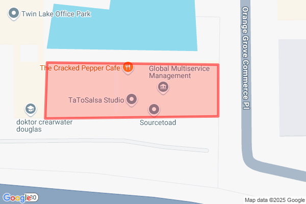

One day we saw an interesting crash that one of our applications was generating a URL so long that Google's static map generation refused to generate it. With a bit of research we discovered lodged in the official [documentation](https://developers.google.com/maps/documentation/maps-static/start#url-size-restriction) that there was a known limit.

:::note

_Maps Static API URLs are restricted to 16384 characters in size. In practice, you will probably not have need for URLs longer than this, unless you produce complicated maps with a high number of markers and paths._

:::

This led us to discovering that Google had the [Encoded Polyline Algorithm Format](https://developers.google.com/maps/documentation/utilities/polylinealgorithm) designed to help pack information in the URL into a dense binary format in plain ASCII text in order to reduce characters. This blog is our journey to writing a little package to accomplish this in PHP.

{/* truncate */}

We did start with a bit of research if any library existed for this, but nothing we found existed in a modern PHP format with a software license we could leverage. Thankfully this was a 10-step algorithm that we could implement in a fresh new library. The algorithm works roughly in this way:

1. Starts with the signed coordinate pairs (`(38.5, -120.2)`)
2. Converts the values into integers that were rounded. (`3850000`, `-12020000`)
3. Converts the values into binary, supporting negatives by using two's complement.
4. Left shifting the binary one bit to optionally invert if negative.
5. Break the binary value into 5-bit chunks reversed.
6. Optionally OR each value with `0x20` if another chunk applies.
7. Convert each value to decimal and add `63` to each one.
8. Convert the value to ASCII (`_p~iF~ps|U`)

You can see how `38.5` became `_p~iF` and `-120.2` became `~ps|U`. The first coordinate doesn't have much of a cost savings, but as the coordinate pairs continue and each pair has the offset from the previous you can tell how the data savings begin to take place.

Imagine if we went to draw a box around our office we might get the coordinate pairs of:

* `28.03630, -82.49009`
* `28.03654, -82.49009`
* `28.03655, -82.49099`
* `28.03629, -82.49100`
* `28.03630, -82.49009`

This helps establish the point that most coordinates are just small iterations of the previous coordinate -- not shifting much in terms of the positioning. If we were to render those with a 19 zoom we'd get this image.

<div class="text--center">
  
</div>

This would form a URL that compounded the coordinate pairs to draw the lines.

```
&markers=28.03630,-82.49009,28.03654,-82.49009,28.03655,-82.49099,28.03629,-82.49100,28.03630,-82.49009
```

If we apply the algorithm we see a much smaller URL decreasing 94 characters to 22.

```
&markers={ybjD`jnvNo@?ArDr@@AuD
```

This was a savings of ~75% less characters and was promising for a real integration. We wrote a quick PHPUnit test to confirm our implementation of the algorithm, and it matched Google's documentation.

```php
#[DataProvider('googleDataProvider')]
public function test_google_polyline_encode(array $coordinates, string $expected): void {
  $this->assertEquals($expected, Bytey::googlePolylineEncode($coordinates));
}

public static function googleDataProvider(): array {
  return [
    'simple example' => [
      'coordinates' => [
        [-179.9832104],
      ],
      'expected' => '`~oia@',
    ],
    'rounding example' => [
      'coordinates' => [
        [48.000006, 2.000004],
        [48.00001, 2.00000],
      ],
      'expected' => 'a_~cH_seK??',
    ],
    'google example' => [
      'coordinates' => [
        [38.5, -120.2],
        [40.7, -120.95],
        [43.252, -126.453],
      ],
      'expected' => '_p~iF~ps|U_ulLnnqC_mqNvxq`@',
    ],
  ];
}
```

So we took our affected entity that was generating a 19.5k character length URL and ran it through the algorithm. The new URL was 3.3k characters, which suggested an 83% reduction in length in a more real life example. A few more real life tests, and we had a fix out the door and a new package built.

Thus, [Bytey](https://github.com/sourcetoad/Bytey) was born.

* [GitHub Repo](https://github.com/sourcetoad/Bytey)
* [Google's Polyline Docs](https://developers.google.com/maps/documentation/utilities/polylinealgorithm)
