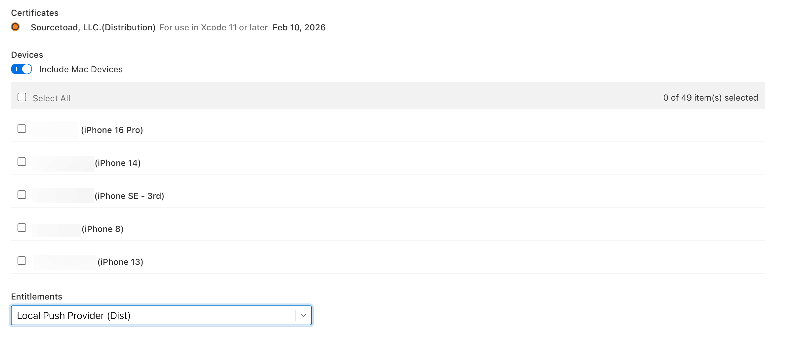
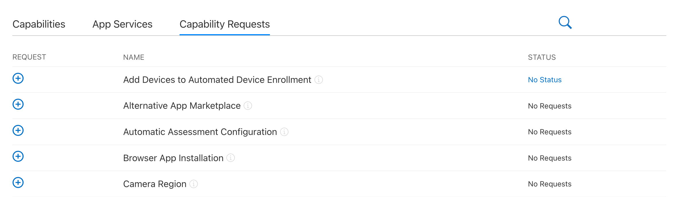
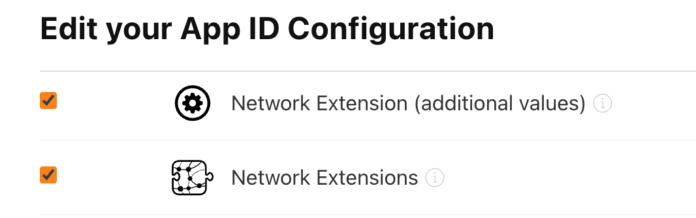

import ImageGrid from '@site/src/components/ImageGrid';

One day our iOS fastlane repository responsible for automatically renewing provisioning profiles and certificates started failing. We utilize [match](https://codesigning.guide) which was affected by this removal causing our provisioning profiles to not renew and thus application builds to fail. The error was suggesting that Apple was removing a parameter we depended on.

```text
The provided entity includes an unknown attribute - 'templateName' is not an attribute on the resource 'profiles' - /data/attributes/templateName
```

This is our journey of solving it both as a temporary workaround and a long-term solution.

{/* truncate */}

We were far from the first people to encounter this error as our scheduled renewals only hit in June 2025 when it seems the issue began in May 2025. So finding an existing bug report ([#29498](https://github.com/fastlane/fastlane/issues/29498)) was a quick find. As our pipeline only had a subset of clients failing we identified pretty quickly that those failing were applications leveraging entitlements (template) attached to their provisioning profile.

<div class="text--center">
  
</div>

Our other projects that leveraged managed capabilities were not affected. So we began to wonder if Apple had begun phasing out entitlements at the provisioning profile level for managed capabilities added at the app level. This made sense because you could only have 1 entitlement template per profile, but you can have many additional capabilities at the app level.

As we signed in and checked those projects the interface in App Store Connect was a bit different and refined.

<div class="text--center">
  
</div>

This led us to discovering that Apple had a [changelog](https://developer.apple.com/help/account/release-notes) for these changes, and it was indeed documented there. Very quickly we determined we had no automated way to resolve this issue at the exact moment. Apple's [documentation](https://developer.apple.com/documentation/appstoreconnectapi/profilecreaterequest/data-data.dictionary/attributes-data.dictionary) showed that the endpoint for creating a profile no longer supported the `templateName` parameter.

This was bad because this is how our automated match process produced new profiles as they expired. If they couldn't attach the intended template then the created profile would be missing the entitlements needed. Our application builds would then fail with error messages like:

```text
error: Provisioning profile "match AdHoc com.sourcetoad.xxx" doesn't match the entitlements file's value for the com.apple.developer.networking.networkextension entitlement. Profile qualification is using entitlement definitions that may be out of date. Connect to network to update.
```

So while a fastlane update solved our profile build pipeline issue, it left us with a broken application build. We got to work with a manual workaround to get these app builds working. Knowing that fastlane was generating an invalid profile we had to start by manually modifying the profile in Apple Developer's portal to edit the profile to change the template (Entitlements) to the right one.

This was upsetting that we could still change the template in the UI, but the API was not allowing us to do so. It seemed this was perhaps part of the slow push to urge users to move to Xcode Cloud instead of manually building & deploying applications. Once done with that we had to load the corrected profile back into our match repository. There is a fastlane import command for this, but it requires the `.cer` and `.p12` files to be present.

#### The workaround

We found the [match_file](https://docs.fastlane.tools/actions/match/#manual-decrypt) command that would allow decrypting the encrypted certificate and private key from our match repository in a standalone manner. This would allow us to hand over all the files to the import command.

```bash
match_file decrypt example.cer
 # Enter the password: ****
 # Enter the password again: ****
match_file decrypt example.p12
 # Enter the password: ****
 # Enter the password again: ****
```

Now we have plaintext files that we can pipe back into our fastlane storage repository with our downloaded (corrected) profile.

```text
➜  certs bundle exec fastlane match import --type development
[17:27:50]: Successfully loaded 'Matchfile' 📄

+------------------------------------------------------------------------------------------------+
|                          Detected Values from './fastlane/Matchfile'                           |
+----------------------+-------------------------------------------------------------------------+
| git_url              | git@github.com:sourcetoad/xxx.git                                       |
| storage_mode         | git                                                                     |
| type                 | development                                                             |
| app_identifier       | ["com.sourcetoad.xxx", "com.sourcetoad.xxx"]                            |
| username             | redacted                                                                |
| generate_apple_certs | true                                                                    |
| git_branch           | redacted                                                                |
| git_full_name        | Fastlane Robot                                                          |
| git_user_email       | xxxxxxxxxxx@sourcetoad.com                                              |
| team_id              | XXXXXXXXXX                                                              |
+----------------------+-------------------------------------------------------------------------+

[17:27:50]: Certificate (.cer) path: xxxx.cer
[17:27:55]: Private key (.p12) path: xxxx.p12
[17:27:57]: Provisioning profile (.mobileprovision or .provisionprofile) path or leave empty to skip this file: match_Development_xxx.mobileprovision
[17:28:03]: Cloning remote git repo...
[17:28:04]: Add git user config to local git repo...
[17:28:04]: Checking out branch redacted...
[17:28:04]: 🔓  Successfully decrypted certificates repo
[17:28:04]: Repo is at: '/var/folders/46/xxx/T/xxxx-xxxxx-xxxx'
[17:28:04]: Login to App Store Connect (xxxxxx@sourcetoad.com)
[17:28:08]: 🔒  Successfully encrypted certificates repo
[17:28:08]: Pushing changes to remote git repo...
[17:28:09]: Finished uploading files to Git Repo [git@github.com:sourcetoad/xxx.git]
```

A bit painful to do manually for all affected profiles, but it worked. We now had working profiles imported into our match repository and application builds automatically started working again on their next build. Now we wondered about a more permanent solution to this issue as the next re-run of our match generation would wipe our manual changes, but first had to research the issue a bit more.

Way back in 2020 when fastlane moved towards the official App Store Connect API it was a big change to how fastlane operated under the hood. No longer would fastlane operate with cookies and web based sessions - it was now using an official Apple API. One user in August 2020 ([#17017](https://github.com/fastlane/fastlane/issues/17017)) noticed that they had no way to programmatically create a provisioning profile with their entitlement. This is when the undocumented, but working, `templateName` parameter was added to fastlane.

The engineers working on fastlane at the time had to request access to the submitter's Apple developer account and peek the API calls when manually creating a profile with the entitlement in the interface.

```json
{
    "data": {
        "type": "profiles",
        "attributes": {
            "name": "test",
            "profileType": "IOS_APP_DEVELOPMENT",
            "teamId": "XXX",
            "templateName": "Hotspot Helper iOS (Dev)"
        },
        "relationships": {}
    }
}
```

That is when the `templateName` parameter was spotted and added to fastlane's App Store Connect API implementation. This parameter was spotted from inspecting the web session API calls, but worked in the official App Store Connect API. However, that field was never documented by Apple in any of the OpenAPI documentation files from version 1.0.0 to 4.0.0. This would be an undocumented parameter that worked until App Store Connect API v4.0.0 was released.

:::info
This [GitHub repository](https://github.com/EvanBacon/App-Store-Connect-OpenAPI-Spec) maintains an historic collection of all App Store Connect API OpenAPI files allowing quick comparisons.
:::

Was it an enhancement that undocumented parameters were now rejected? An intentional removal? An accident? We know 2 months later that method is still not working so our only option to move onward to capabilities.

#### On to Capabilities
It appears Apple wants us to use capabilities now and sadly did not automatically migrate our existing profile entitlements to capabilities. So we started researching on the process to either [migrate our entitlements](https://developer.apple.com/contact/request/entitlement-migration-requests) or just go through the process of [requesting the capabilities](https://developer.apple.com/contact/request/local-push-connectivity) again. Like folks probably know in the industry only the account holder can request capabilities or see the form to request them so it took a bit of back and forth with some clients to get to this point.

import localPushForm from './local-push.png';
import migrateForm from './migrate.png';

<ImageGrid
  images={[
    {src: localPushForm, alt: 'Local Push Capability Request', caption: 'Local Push Request'},
    {src: migrateForm, alt: 'Migrate Entitlement Request', caption: 'Migrate Request'}
  ]}
/>

We took the path of requesting the capabilities again as that form was familiar to us from previous requests. We waited roughly a month after submission and got approved for the capabilities. While we can't automate the applying of the capabilities to the application identifier in fastlane we can make a one-time change in the interface to apply this.

<div class="text--center">
  
</div>

This was as easy as checking a box, and we were ready to let our match pipeline regenerate our provisioning profiles. Apple must crawl any capability on your application identifier to automatically turn them into entitlements in your provisioning profile during the generation process. We wanted to confirm this technically by inspecting the generated profile.

```bash
➜  security cms -D -i match_AppStore_xxxx.mobileprovision | plutil -p -
{
  "AppIDName" => "Redacted App"
  "Entitlements" => {
    "application-identifier" => "XXX.com.xxxx.xxxx"
    "aps-environment" => "production"
    "beta-reports-active" => 1
    "com.apple.developer.networking.networkextension" => [
      0 => "app-push-provider"
      1 => "app-proxy-provider"
      2 => "content-filter-provider"
      3 => "packet-tunnel-provider"
      4 => "dns-proxy"
      5 => "dns-settings"
      6 => "relay"
    ]
  "Version" => 1
}
```

Using the security tool we can dump out the XML contents of the profile then pass it onward to `plutil` to pretty print it. We've excluded a good deal of the contents, but the important part to notate is our entitlements are back in our profile. It was quite a journey of discovery, short-term fixes and a permanent solution - but we are back to a working state.

:::tip

Struggling with an automated CI/CD mobile pipeline? We can help! [Contact us](https://sourcetoad.com/application-maintenance) to get you back on track.

:::
