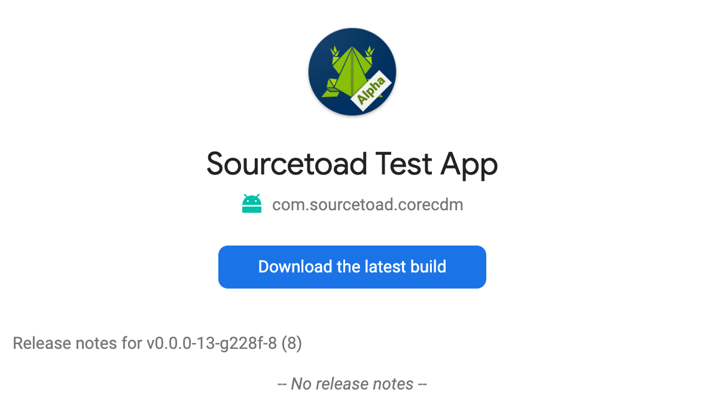
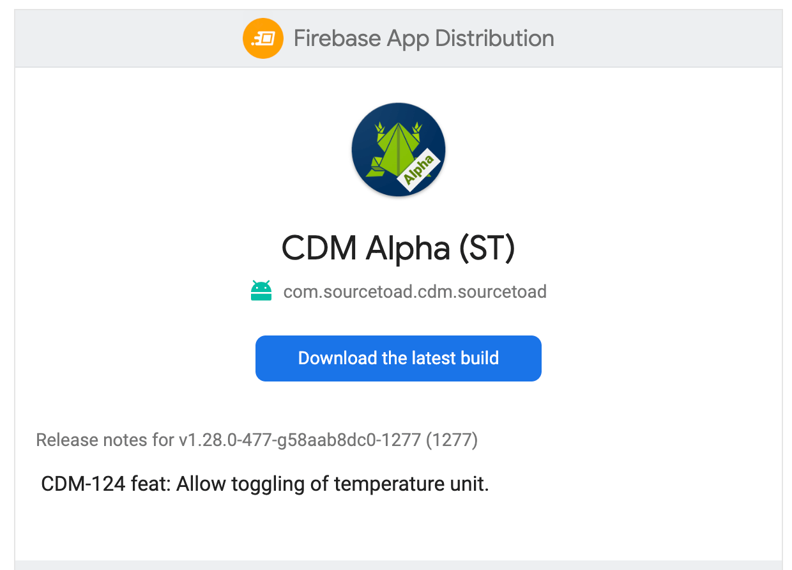

As our pipelines evolved to support many different environments we felt we needed a bit more automation around our alpha builds. Builds past alpha were generally tagged releases with human written changelogs, but alpha builds were bleeding edge right from our main branch for internal use. We wanted to provide testers with a bit more context on what changed in each build without them needing to go hunt for information.

This is our journey of a bit of automation to plug into Firebase App Distribution to provide automatic changelogs for our builds.

{/* truncate */}

Emails used to come in as new alpha builds were automatically uploaded looking a bit like this:

<div class="text--center">
  
</div>

They were bland and needed some automation. So we got to work looking at our fastlane upload with Firebase.

```ruby
firebase_app_distribution(
  app: ENV["FASTLANE_APP_ID"],
  android_artifact_type: "APK",
  groups: "sourcetoad"
)
```

A quick peek of their [docs](https://firebase.google.com/docs/app-distribution/ios/distribute-fastlane#distribute) we noticed 2 parameters that caught our eye:
- `release_notes`: A string to be used as the changelog for the release.
- `release_notes_file`: A file path to a text file containing the changelog for the  release.

Knowing we could easily obtain commits in our GitHub Actions pipeline we theorized we could generate a file based on the commits and pass that to Firebase.

```yaml
- name: Release Notes
  shell: bash
  run: echo $JSON | jq '.event.commits[]' | jq '.message' | jq tostring | jq '.[0:100]' > release_notes.txt
  env:
    JSON: ${{ toJSON(github) }}
```

With the power of [jq](https://jqlang.org) - we did this relatively quickly. We grabbed the commit messages from the [GitHub event payload](https://docs.github.com/en/enterprise-cloud@latest/webhooks/webhook-events-and-payloads#push), converted them to strings and truncated them to 100 characters to shorten those massive Dependabot commits. We then wrote that to a file called `release_notes.txt`.

We then dug into the source code of the [firebase_app_distribution action](https://github.com/firebase/fastlane-plugin-firebase_app_distribution/blob/master/lib/fastlane/plugin/firebase_app_distribution/actions/firebase_app_distribution_action.rb#L537) so we could find out the environment variable name that corresponded to the `release_notes_file` parameter.

Once discovered (`FIREBASEAPPDISTRO_RELEASE_NOTES_FILE`) we updated our fastlane step to include that environment variable and waited for the next merge.

```yaml
FIREBASEAPPDISTRO_RELEASE_NOTES_FILE: ${{ github.workspace }}/release_notes.txt
```

Sure enough as the email arrived we had a beautiful internal changelog included in the email.

<div class="text--center">
  
</div>

It was a small change that made a large difference in terms of supporting our internal testers. They had a much easier time understanding the intent of each build.

 * [fastlane.tools](https://fastlane.tools)
 * [Firebase - Android](https://firebase.google.com/docs/app-distribution/android/distribute-fastlane?apptype=apk)
 * [Firebase - iOS](https://firebase.google.com/docs/app-distribution/ios/distribute-fastlane)
 * [GitHub - fastlane-plugin-firebase_app_distribution](https://github.com/firebase/fastlane-plugin-firebase_app_distribution)
