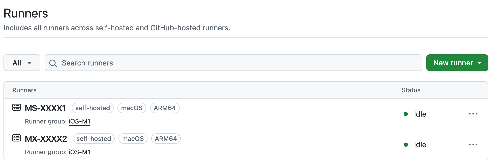

No matter the project or stack we strive to automate the testing and deployment pipeline as much as possible. Mobile applications are no different, but do come with their own set of challenges between iOS and Android. We are happy to have a fully automated solution for both platforms that pieces together several _fastlane_ tools to achieve an elegant solution.

We can share how all these pieces fit together to create a robust mobile app pipeline.

{/* truncate */}

Right out of the gate for any pipeline we rely on [GitHub Actions](https://github.com/features/actions) to run our pipelines. With our code being hosted in GitHub and no longer needing to rely on managing our own Jenkins servers the flexibility of ephemeral runners provided by GitHub have been amazing.

<div class="text--center">
  
</div>

We do however run our own macOS runners as the price point for GitHub-hosted runners is a bit steep at 8c per minute compared to .002c per minute on Linux.

:::note

Up-to-date pricing on GitHub Action instances can be found on the [official docs](https://docs.github.com/en/billing/reference/actions-runner-pricing).

:::

We've found luck in getting a bare metal Mac from [MacStadium](https://macstadium.com/bare-metal-mac) and running a GitHub self-hosted runner on it. This allows us to have a dedicated macOS environment for iOS builds while keeping costs down.

Utilizing this private runner couldn't be any easier with GitHub Actions. We create tags to mark the runners with their respective unique traits - like `ARM64` or `INTEL`, then a workflow file can opt into that runner assuming it aligns on the tags.

```yaml
jobs:
  build_ios:
    # runs-on: macos-26
    runs-on: [self-hosted, macos, ARM64]
    environment: demo-alpha
    steps:
```

In this circumstance we only need self-hosted runners when building an iOS application as Android builds can be done on the standard GitHub-hosted Ubuntu runners. So assuming we are building an iOS application lets dive into the high level steps of our pipeline.

In order for our application and dependent systems to all know what version this build is we start by taking the active git tag and shoving it into our `.env` file for the build to utilize.

```yaml
- name: Set Vars
  id: vars
  shell: bash
  run: echo "version=$(git describe --tags --abbrev=7)" >> $GITHUB_OUTPUT
```

With that version set we can do all we need with error tracking tools, [badges](https://opensource.sourcetoad.com/blog/2024/introducing-add-badge) and more. After we've done the more boring aspect of installing dependencies and right version of Ruby/Node we are set to get into the meat of the build.

This is where _fastlane_ begins to shine with the [match](https://codesigning.guide) tool which effectively manages our certificates and provisioning profiles for our iOS applications. With such a small `Matchfile` we already largely configured for automating our code signing.

```ruby
storage_mode("git")
type("adhoc")

app_identifier("com.sourcetoad.xxx")
username("xxx@example.com")

git_url("git@github.com:xxx/yyy.git")
git_branch("internal")
git_full_name("Fastlane Robot")
git_user_email("xxxx@example.com")

team_id("XXXX11111")
```

This configuration does a bit:

 * We configure our storage as backed by a git repository.
 * We configure the intended profile type and intended app identifier.
 * We configure the git branch to use for storing the certificates & profiles.

Assuming we properly set up [App Store Connect API](https://developer.apple.com/documentation/appstoreconnectapi) we are one simple workflow away from generating managed certificates and profiles for our application.

```ruby
lane :certificates do
  app_store_connect_api_key()
  sync_code_signing(
    force_for_new_devices: true
  )
end
```

As things expire or new devices are added we can automatically update our profiles without any human intervention with events and scheduled runs. Of course [Apple doesn't always make this possible](https://opensource.sourcetoad.com/blog/2025/apple-templates-fastlane) for us with some things that simply cannot be automated over an API, but for the most part we can keep things running smoothly.

This lane and configuration lives outside our project repository so we can keep the responsibility of generating and maintaining certificates separate from the application code itself. This presents an interesting challenge - how does our application know which certificates and profiles to use when building?

After _match_ is completed installing a provisioning profile & certificate it'll output environment variables like this.

```
[16:43:32]: Installing provisioning profile...

+---------------------+-------------------------------------------------+------------------------------------------------------------------------------------------------------------------------+
| Parameter           | Environment Variable                            | Value                                                                                                                  |
+---------------------+-------------------------------------------------+------------------------------------------------------------------------------------------------------------------------+
| App Identifier      |                                                 | com.sourcetoad.test                                                                                                    |
| Type                |                                                 | adhoc                                                                                                                  |
| Platform            |                                                 | ios                                                                                                                    |
| Profile UUID        | sigh_com.sourcetoad.test_adhoc                  | 00000000-0000-0000-0000-000000000000                                                                                   |
| Profile Name        | sigh_com.sourcetoad.test_adhoc_profile-name     | match AdHoc com.sourcetoad.test                                                                                        |
| Profile Path        | sigh_com.sourcetoad.test_adhoc_profile-path     | /Users/user/Library/MobileDevice/Provisioning Profiles/00000000-0000-0000-0000-000000000000.mobileprovision            |
| Development Team ID | sigh_com.sourcetoad.test_adhoc_team-id          | XXXXXXXXXX                                                                                                             |
| Certificate Name    | sigh_com.sourcetoad.test_adhoc_certificate-name | Apple Distribution: Sourcetoad, LLC. (XXXXXXXXXX)                                                                      |
+---------------------+----------------------------------------------------------+---------------------------------------------------------------------------------------------------------------+
```

So you can devise programmatically ahead of time the environment variable that will contain the profile path, team id, certificate name and profile name. Glancing this output above you can tell the pattern is basically - `sigh_{app-identifier}_{type}_{property}`.

Since this test application is `com.sourcetoad.test` and the type is `adhoc` we know all the environment variable names that will house our needed profile information. So back in our `Fastfile` of the application we can leverage some actions to change the needed files to leverage this profile. In some projects since the package name is different per environment we may need to dynamically change that as well, but for this example we'll keep it simple.

```ruby
sync_code_signing(
    type: "adhoc",
    readonly: true,
    app_identifier: 'com.sourcetoad.test',
    git_branch: "internal",
    team_id: "XXXXXXXXXX",
)
update_code_signing_settings(
    profile_name: ENV["sigh_com.sourcetoad.test_adhoc_profile-name"],
    path: "test.xcodeproj",
    team_id: ENV["sigh_com.sourcetoad.test_adhoc_team-id"],
    code_sign_identity: "Apple Distribution",
)
```
Breaking this down we do the following:

 * `sync_code_signing` is another way to call [match](https://docs.fastlane.tools/actions/sync_code_signing). In our build pipeline we don't want to modify anything so we set it to `readonly: true`. We rely on our other repository and scheduled workflows to keep our profiles up to date. This helps us reduce the scope of permissions and credentials needed for a build pipeline.
 * `update_code_signing_settings` is an excellent [action](https://docs.fastlane.tools/actions/update_code_signing_settings/) that allows us to change common fields like profile and code sign identity on the project itself. This is helpful when a non-production build may be to Firebase, but a UAT/Production build to App Store Connect.

Once that is complete all the iOS prework is completed, and we just have to run [build_app](https://docs.fastlane.tools/actions/build_app/#build_app) which kicks off the actual compilation and signing of the application.

For the most part this is the easiest part of the pipeline - once all the prework is done building is just a single command. Once done we may kick off further automation for things like:

 * Upload sourcemaps to [Sentry](https://github.com/getsentry/sentry-fastlane-plugin).
 * Upload builds to [Firebase App Distribution](https://github.com/firebase/fastlane-plugin-firebase_app_distribution).
 * [Emit a message into Slack](https://github.com/slackapi/slack-github-action) for testers.

The beauty of _fastlane_ is you can plug and play whatever integrations you have in order to make your pipeline complete. If we pivot over to Android we will find a much simpler pipeline. With Android, we generally have to be sure we do one thing correctly and that's set the proper package name prior to any building.

Most of our Android workflows start just like this.

```ruby
versionName = ENV["GIT_TAG_NAME"]
versionCode = ENV["GITHUB_RUN_NUMBER"]

android_set_version_name(
  version_name: versionName,
)
android_set_version_code(
  version_code: versionCode
)

rename_android(
  path: "./",
  package_name: "com.sourcetoad.test",
  new_package_name: ENV["PACKAGE_NAME"]
)

android_change_app_name(newName: ENV["APP_NAME"])
update_android_strings(
  xml_path: "./app/src/main/res/values/strings.xml",
  block: lambda { |strings|
    strings['app_name'] = ENV["APP_NAME"]
  }
)
```

We set the [version name and code](https://github.com/beplus/fastlane-plugin-versioning_android) based on our git tag and GitHub run number. We then leverage the [rename_android](https://github.com/sourcetoad/fastlane-plugin-rename_android) plugin (that we maintain) to change the package name in all the needed files of an Android application. We do this so we can have different builds of the application installed at once. There is a real benefit of being able to have an Alpha and Staging build installed at same time for testing differences.

After that we want to [rename all the odd files](https://github.com/MaximusMcCann/fastlane-plugin-android_change_app_name) that keep the application name, so things like permission prompts and more are covered. We found as a pipeline evolved we needed a few actions/plugins here and there to automate changes to random one-off files.

Once all of that is done we are set to build.

```ruby
gradle(task: "clean")
gradle(task: options[:buildTask], build_type: "Release", properties: {
  versionCode: options[:versionCode].to_i,
  versionName: options[:versionName],
  "print_command" => false,
  "android.injected.signing.store.file" => ENV["KEYSTORE_FILE"],
  "android.injected.signing.store.password" => ENV["KEYSTORE_PASSWORD"],
  "android.injected.signing.key.alias" => ENV["KEY_ALIAS"],
  "android.injected.signing.key.password" => ENV["KEY_PASSWORD"],
})
```

We found a good pattern of forcing a clean build then kicking off a build (whether `assembleRelease` or `bundleRelease`) with all the needed keystore information injected. This keeps our CI pipeline from spitting out secrets in build output or projects needing to container test or production keystore files. Depending on the lane we may want an `.apk` or `.aab` so we keep that dynamic as well for our different use cases.

Those environment variables are stored in GitHub secrets and injected into the workflow prior to execution with something like this:

```yaml
- name: Setup Signing Key
  shell: bash
  run: echo $ANDROID_KEYSTORE | base64 --decode > release.keystore
  working-directory: android/app
  env:
    ANDROID_KEYSTORE: ${{ env.ANDROID_KEYSTORE }}

- name: Fastlane
  shell: bash
  run: bundle exec fastlane build
  working-directory: android
  env:
    APP_NAME: 'Sourcetoad Test'
    PACKAGE_NAME: 'com.sourcetoad.test'
    GIT_TAG_NAME: ${{ steps.vars.outputs.version }}
    SUPPLY_JSON_KEY: ${{ github.workspace }}/google_serviceaccount_config.json
    FIREBASEAPPDISTRO_RELEASE_NOTES_FILE: ${{ github.workspace }}/android/fastlane/release_notes.txt
    KEYSTORE_FILE: ${{ github.workspace }}/android/app/release.keystore
    KEYSTORE_PASSWORD: ${{ secrets.ANDROID_KEYSTORE_PASSWORD }}
    KEY_ALIAS: ${{ secrets.ANDROID_KEY_ALIAS }}
    KEY_PASSWORD: ${{ secrets.ANDROID_KEY_PASSWORD }}
```

This snippet shows how a mix of dynamically generated files (like release notes), secrets (like keystore) and static values can all play together for a simple environment value for the build to leverage.

At that point we have built iOS and Android applications in a fully automated manner. Everything from our certificates to keystores are managed securely and part of the pipeline. Sometimes taking it all the way to automatically putting a build into review for both platforms. We can push builds to testers or production with no human intervention keeping our teams working on bugs & features instead of manual build tasks.

:::tip

Struggling with an automated CI/CD mobile pipeline? We can help! [Contact us](https://sourcetoad.com/application-maintenance) to get you back on track.

:::
