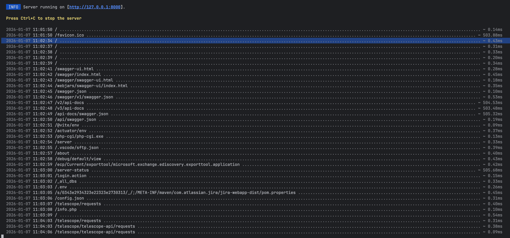
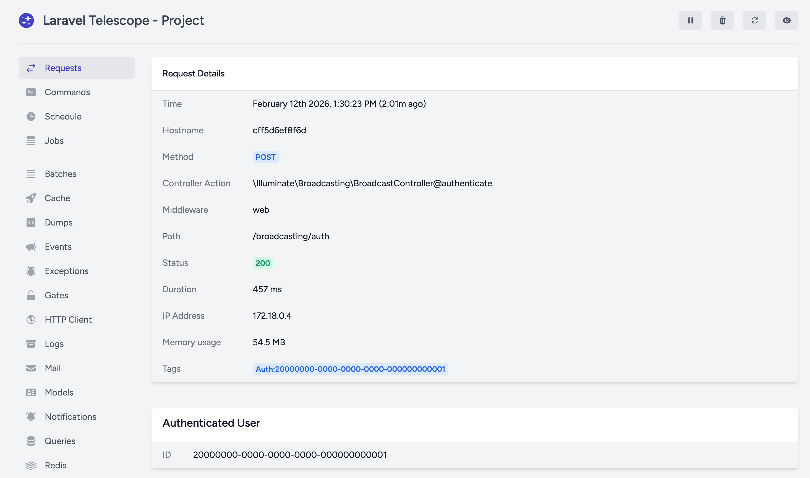

Every so often during development we find ourselves in the need of having a secure (SSL) connection to a locally running project. In most cases we are developing against a service that has webhooks. Some services have a robust library of mock payloads and others just require us to wire up a webhook tunnel to our local machine and trigger some events in order to complete development.

There is an endless amount of services that provide this tunnel functionality, and we historically used ngrok, but since moved on to a self-hosted solution of [SirTunnel](https://github.com/anderspitman/SirTunnel). It worked under the hood by running [Caddy](https://caddyserver.com) and minting fresh SSL certificates for whatever subdomain you requested.

Of course minting fresh SSL certificates had a downside and that was certificate transparency logs. We'd notice moments after creating a new certificate that a bunch of different IP addresses would start hitting our local machine. We assume this is because the certificate transparency logs were being monitored by bots that then crawled the new certificate to investigate. So we were surprised one day to be alerted to one of our API keys being leaked & stolen.

<!-- truncate -->

Now with a key rotated we got to work investigating how we lost a key and how to prevent it from happening again. We knew since it was a local key from an engineer's computer that the vector had to be an insecure exposure of a local Laravel application. We spawned two new fresh certificates proxied to local Laravel applications and monitored the traffic.

```
Data:
  Version: 3 (0x2)
  Serial Number:
    06:ad:36:77:90:db:b3:82:29:72:ea:34:a0:bf:23:50:0a:d4
  Signature Algorithm: ecdsa-with-SHA384
  Issuer: (CA ID: 295809)
    commonName                = E8
    organizationName          = Let's Encrypt
    countryName               = US
  Validity
    Not Before: Jan  7 15:02:48 2026 GMT
    Not After : Apr  7 15:02:47 2026 GMT
  Subject:
    commonName                = hacktest.local.sourcetoadtest.com
```

What was crazy to us is seeing this certificate minted at 15:02:48 and having external requests hitting our local machine 10 seconds prior to the start date of the certificate. This doesn't add up, but regardless after another test we are confident to say that within seconds of minting a new certificate there are scripts/bots checking our local website.

<div class="text--center">
  
</div>

These requests range from the basic misconfigured servers checks to more targeted attacks against PHP applications. A few of the requests were attempts against unrelated technologies and languages which leads us to believe these are just generic scans of the new certificate hunting for anything insecure. It was concerning to see some of the requests trying to extract API documentation, abuse older vulnerabilities in Vite or check if we had a misconfigured debug bar.

All in all with a modern Laravel application with up-to-date dependencies we were surprised to find out we lost our secret API key again. That was until we looked at the logs again and spotted API calls to Telescope, and it all clicked together.

<div class="text--center">
  
</div>

[Laravel Telescope](https://laravel.com/docs/12.x/telescope) is a little companion tool for local development that helps log outbound HTTP calls, data queries, jobs and many more. It is a gold mine of information and also extremely helpful for local development. However, since we exposed our local environment to the Internet this product was also exposed, and we had no authentication on it.

So we went off to the [docs](https://laravel.com/docs/12.x/telescope#dashboard-authorization) to see if we made a mistake.

> The Telescope dashboard may be accessed via the `/telescope` route. By default, you will only be able to access this dashboard in the local environment. Within your `app/Providers/TelescopeServiceProvider.php` file, there is an authorization gate definition. This authorization gate controls access to Telescope in non-local environments.

It seemed Telescope had a method for protecting the dashboard in non-local environments, but for us this was a development dependency and never even installed in a non-local environment. So we wondered how we could protect this service locally without having to do workarounds like changing our `APP_ENV=production` to leverage the built-in authorization gate.

We couldn't really find anything in the docs, so we checked out other solutions we know were secure:

 * [Yii2 Gii](https://www.yiiframework.com/extension/yiisoft/yii2-gii/doc/api/2.0/yii-gii-module#$allowedIPs-detail) - Had an `$allowedIps` property to restrict access to certain IP addresses.
 * [Vite](https://vite.dev/config/server-options#server-allowedhosts) - Had an `allowedHosts` option to restrict access to certain hostnames.

So we reached out to Laravel to see if they were interested in adding a similar feature to Telescope and any other package affected by this flaw. They responded near immediately and asked a few follow-up questions and then implemented a new package and solution within a few weeks. We saw the introduction of [Laravel Sentinel](https://github.com/laravel/sentinel) which was a small little package that leveraged the existing trusted proxies feature of Laravel.

We then spotted a few pull requests to other packages implementing the Sentinel package:

 * [Laravel Horizon](https://github.com/laravel/horizon/pull/1691)
 * [Laravel Telescope](https://github.com/laravel/telescope/pull/1674)
 * [Laravel Pulse](https://github.com/laravel/pulse/pull/475)

Now with an upgraded Telescope and a new proxy service we felt pretty secure again. The benefit of a new proxy service was domains were not minted on the fly and instead leveraged a wildcard domain. This reduced the instant exposure of any new certificate that our previous solution of SirTunnel did, because our wildcard SSL domain did not require new entries into transparency logs as used. Additionally, the service employs their own protections against their network blocking those pesky IPs that do nothing but probe the web.

Paired with an updated version of Laravel Telescope that leveraged Laravel Sentinel we knew it was gating access to the Telescope dashboard to only local IP addresses.

```php title='src/Drivers/Driver.php'
protected function isPrivateIp(string $requestIp): bool
{
  if (method_exists(IpUtils::class, 'isPrivateIp')) {
    return IpUtils::isPrivateIp($requestIp);
  }

  return IpUtils::checkIp($requestIp, [
    '127.0.0.0/8',    // RFC1700 (Loopback)
    '10.0.0.0/8',     // RFC1918
    '192.168.0.0/16', // RFC1918
    '172.16.0.0/12',  // RFC1918
    '169.254.0.0/16', // RFC3927
    '0.0.0.0/8',      // RFC5735
    '240.0.0.0/4',    // RFC1112
    '::1/128',        // Loopback
    'fc00::/7',       // Unique Local Address
    'fe80::/10',      // Link Local Address
    '::ffff:0:0/96',  // IPv4 translations
    '::/128',         // Unspecified address
  ]);
}
```

Of course, we must remain diligent anytime we have to expose a local environment to the Internet. We must understand how every package that deals with logging, debugging or any other sensitive information is properly protected. Thanks again to Laravel for a quick turnaround on enhancing the security of their packages.
