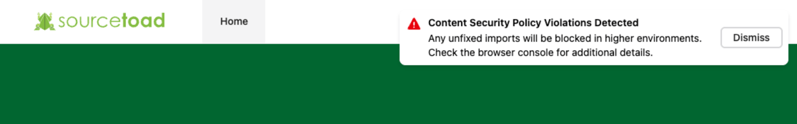

Every so often we'd deploy a change and be greeted with a CSP violation preventing our change from working properly. An easy mistake that was easy enough to resolve. We wanted to improve that process such that we could capture CSP violations locally and resolve prior to deployment. This post will cover how we accomplished that including how we wired it up with our [existing ECS containerized Laravel application](https://opensource.sourcetoad.com/blog/2023/laravel-on-aws-fargate-at-sourcetoad).

{/* truncate */}

For a refresher, [CSP](https://developer.mozilla.org/en-US/docs/Web/HTTP/CSP) is a collection of features that instruct your end user's web browser to place restrictions on the things your web application can do. This can be a wonderful defense against XSS attacks, blocking clickjacking or ensuring overbearing extensions don't inject scripts into your application. As an engineer you have should extreme confidence in what your application is doing, such that you can design a CSP that spells out what your application can do.

As of July 2026, the CSP Level 3 specification has the following non-experimental directives:

* `child-src` - Think nested contexts (workers, frames, etc).
* `connect-src` - Think `fetch`, `XMLHttpRequest`, `WebSocket`, and `EventSource`.
* `default-src` - The default directive in case a more specific directive is not specified.
* `font-src` - Think `@font-face` and `link[rel=preload]`.
* `frame-src` - Think `iframe` or `frame` elements.
* `img-src` - Think `img` elements.
* `manifest-src` - Think `link[rel=manifest]`.
* `media-src` - Think `audio` and `video` elements.
* `object-src` - Think `object` and `embed` elements.
* `script-src` - Think `script` elements and `eval()`.
* `style-src` - Think `style` elements and `style` attributes.
* `worker-src` - Think `Worker`, `SharedWorker`, and `ServiceWorker` elements.

:::info

We skipped a few `-elem` and `-attr` directives that further refine the above directives to control specific elements or attributes. This should help either way show the power behind what a CSP directive can enforce.

:::


With 1 line you could block all external images except those uploaded and served from your own CDN. You could be sure your client side code is only networking with your own API. The possibilities are endless, but sometimes the challenge remains that you need knowledge on what your application does technically in order to write a CSP policy that actually works. This gets a bit difficult if you have 3rd party extensions (Think Google Maps, ArcGIS or Sentry) as you'll need to refine a policy that works around those extensions.

CSP designed a method to help you in this journey with an enforce mode and report mode. As the names suggest enforce mode will enforce the CSP policy and violations will be blocked & reported. Report mode will not block violations, but still report them.

```text
Content-Security-Policy: <directive>; <other-directive>;
Content-Security-Policy-Report-Only: <directive>; <other-directive>;
```

We had an existing policy that was injected into our NGINX layer via a template file. It was set up in a way that was a bit more maintainable than a single long line of directives. This made it easier to configure each directive and even configure those pesky ones that need environment specific values. A snippet of a few directives of that is below.

```nginx
# CSP
set $CSP_DEFAULT_SRC "default-src 'none'";
set $CSP_FONT_SRC "font-src 'self' data: fonts.bunny.net js.arcgis.com";
set $CSP_FRAME_SRC "frame-src 'self' ${CONNECT_CSP_URL} app.powerbi.com";

add_header Content-Security-Policy "${CSP_DEFAULT_SRC}; ${CSP_FONT_SRC}; ${CSP_FRAME_SRC}; report-uri ${SENTRY_CSP_URL};" always;
```

We preferred the NGINX layer because it made the responsibility of the policy split from the application. Sure it increased the difficulty a bit, but our entry point controlling everything CSP seemed a bit easier. Since auditors will want to be sure your policy applies on all endpoints - including errors. This is where an NGINX defined CSP shined a bit more than an application level one.

Locally this was a challenge, because our policies would be massively different. We may be running development servers to serve assets, hosts may be spawning on random Docker internal ports and assets coming from a locally served RustFS instance. It also didn't make sense to report our failures anywhere and clog up Sentry, so we had a problem to solve.

We ended up building a tiered system of CSP parameters. Such that we had a base (common for everything), local (specific to local) & deploy (specific to any deployed environment) layers. This worked well, but now we had an issue in local development that needed something a bit more elegant for engineers to notice their change would require a CSP adaption. Sure logs were going into the console, but those could be missed easily.

We discovered the [ReportingObserver](https://developer.mozilla.org/en-US/docs/Web/API/ReportingObserver/ReportingObserver) which as the name suggests spawns an Observer that can listen for reports/violations that may occur at the CSP layer. So for our Vue application we did something like this:

```js
import {onBeforeUnmount, onMounted} from 'vue';

export default function useCspViolationMonitor() {
    let observer;

    onMounted(() => {
        if (!window.ReportingObserver) {
            return;
        }

        observer = new ReportingObserver(
            (reports) => {
                reports.forEach((report) => {
                    // Show a Toast message of the violation.
                    console.warn('Content Security Policy violation:', report);
                });
            },
            {
                types: ['csp-violation'],
                buffered: true,
            },
        );

        observer.observe();
    });

    onBeforeUnmount(() => {
        observer?.disconnect();
    });
}
```

If a CSP violation was triggered it would display a Toast message instruction the user to check the console.



The engineer at that point would find the relevant policy file (base, local or deploy) and adapt it. So now we had a more robust pipeline to prevent releasing code that would immediately fail a CSP directive. Our deployed CSP policies would continue reporting violations to Sentry and those went through our regular alerting process.
